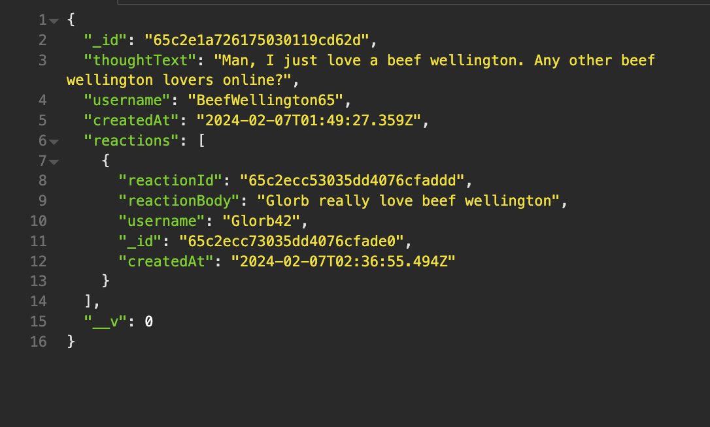

# AA Social Network API

## Description

This project is an API that uses Mongoose for a MongoDB connection. This API can handle functionality for adding/removing users, friends lists, and creating/modifying/removing posts & comments.

- This project was created to practice MongoDB/Mongoose and build out a template for any future projects that may need to use a similar API. 
- Building this project provided great practice for working with MongoDB and learning fundamental patterns that will become useful for creating similar APIs and full stack applications that utilize MongoDB.

## Usage

Clone the repo, run `npm i`, then `npm start`. Then, make your API calls in Postman, Insomnia, etc. to test it out. Must have MongoDB installed.

#### [Find the walkthrough video here.](https://github.com/abealberts/aa-social-network-api)

#### Example of API response:
